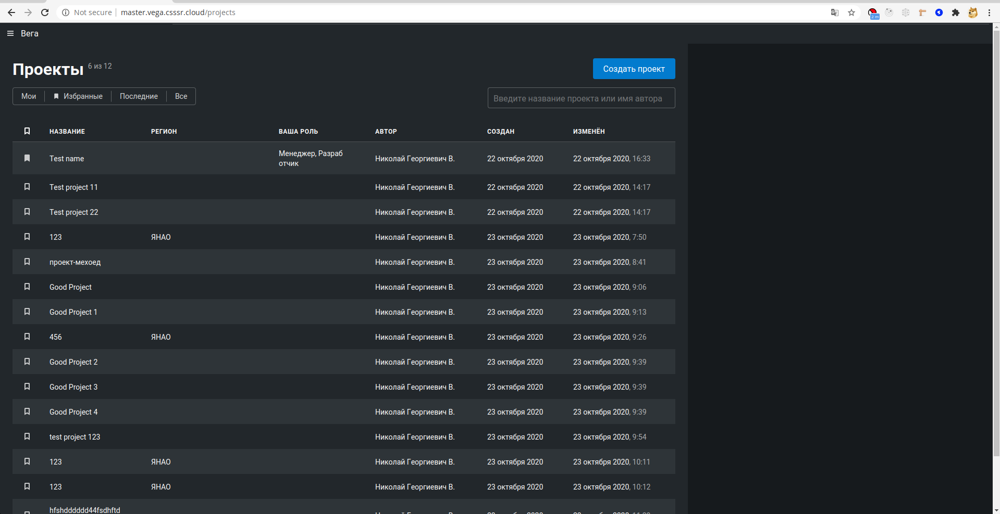
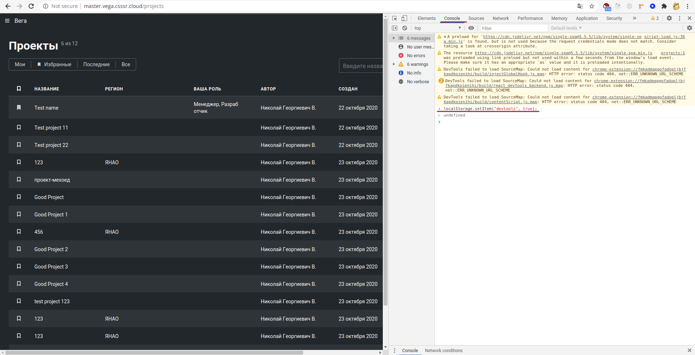
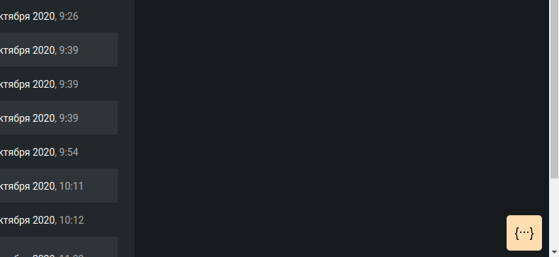
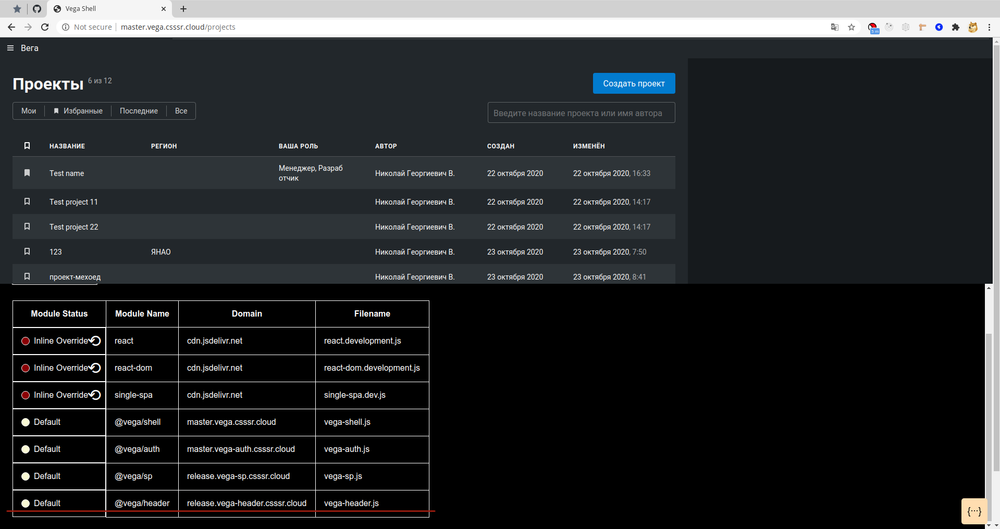
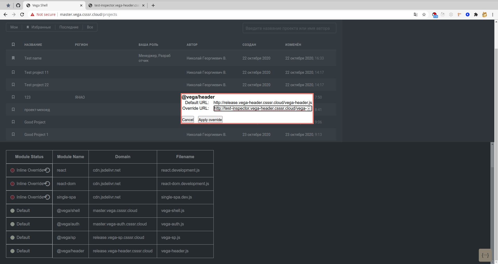
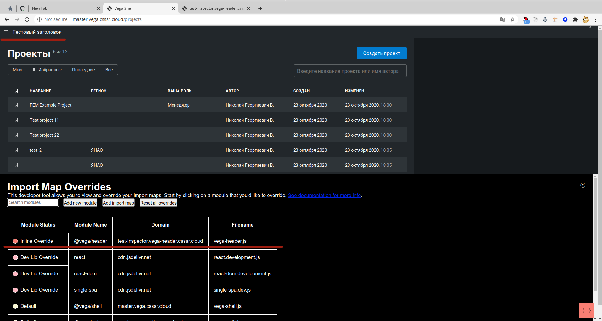
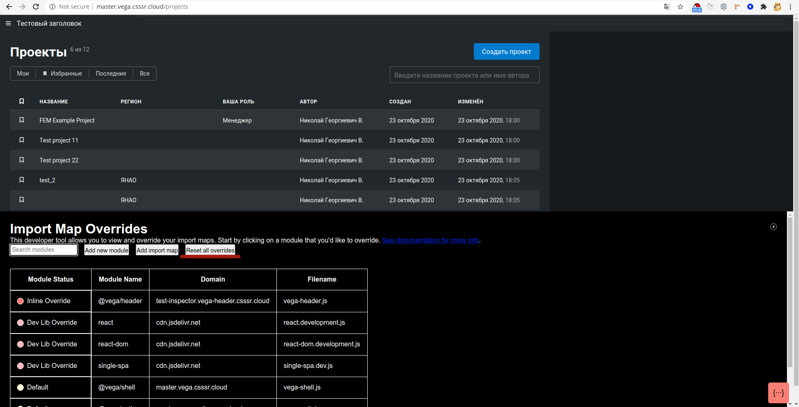

# Работа с single-spa-inspector

Устанавливаем расширение:

- [Chrome](https://chrome.google.com/webstore/detail/single-spa-inspector/emldbibkihanfiaiaghebffnbahjcgcp)
- [Firefox](https://addons.mozilla.org/en-US/firefox/addon/single-spa-inspector/)

После установки открыть в браузере стенд с vega-shell, например, `http://master.vega.csssr.cloud/projects`

Для того чтобы показать инспектор, нужно в `localstorage` поместить запись `devtools` со значением `true`.

Это можно сделать введя `localStorage.setItem("devtools", true);` в консоль. После чего жмём `Enter`. Перезагружаем страницу.

После перезагрузки страницы в нижнем правом углу отобразится значок `{...}`. Жмём на него чтобы открыть `single-spa-inspector`.

Находим в списке интересующий нас микросервис, например `vega-header` и жмём на него.

В открывшемся окне вводим путь. Например, `http://test-inspector.vega-header.csssr.cloud/vega-header.js`.

Путь до скрипта на стенде имеет вид: `http://{BRANCH_NAME}.vega-{MICROSERVICE_NAME}.csssr.cloud/vega-{MICROSERVICE_NAME}.js`

Перезагружаем страницу и видим результат.

Для того чтобы откатить изменения нужно нажать на `Reset all overrides`

Чтобы скрыть инспектор, нужно просто удалить запись `devtools` из `localstorage`.
